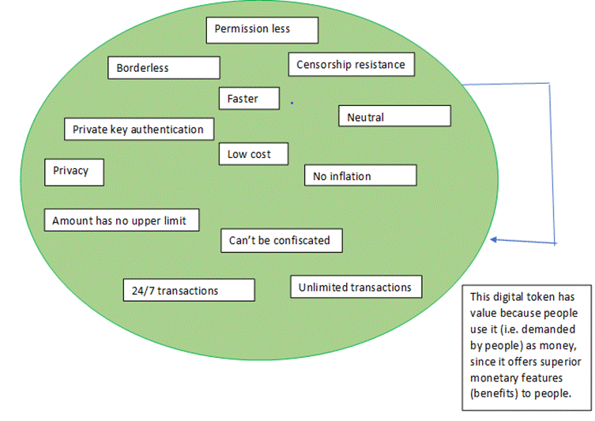

=== **Cryptocurrency and Democracy 2.0 - PART II**

==== **Scratching some basics first**

*1.	What is supply and demand?*

It is the reflection in value/price change of a commodity based on its supply and demand variation and it can be noticed in all commodities. The table below explains the different scenarios.

_Table 1_

[cols=",,",]
[options="header"]
|===
|*Supply from producers* |*Demand from buyers* |*_Value/Price change_*
|Stable |Stable |_Stable_
|Stable |Increased |_Increased_
|Stable |Decreased |_Decreased_
|Increased |Stable |_Decreased_
|Increased |Increased |_Stable_
|Increased |Decreased |_Highly decreased_
|Decreased |Stable |_Increased_
|Decreased |Increased |_Highly increased_
|Decreased |Decreased |_Stable_
|===

For instance, if the supply of onion increases due to farmers reaping a good harvest, it's price will come down.

*2.	What is money?*

People need to exchange one type of commodity with another type of commodity for their transactions. Bartering system was hard to use and scale. Hence, people eventually started using certain, specific commodities as money to buy & sell all other commodities. These chosen commodities usually have some common unique properties. Few of the properties are listed below.

1.	Limited supply (called scarcity) and the commodity cannot be duplicated. So its value can be retained over time.

2.	Very hard to profitably produce the commodity, so people's interest to create more wealth by producing this commodity is restricted.

3.	Portability and hence people can transact this commodity along longer distances.

4.	Durable and doesn't perish over time.

5.	Divisible and hence producing smaller units of the commodity is possible.

6.	Negligible or minimal uses of the commodity outside of its monetary use. Hence price changes that occur due to demand fluctuations from non-monetary uses of the commodity is eliminated/reduced.

7.	Easily verifiable for originality.

If one thinks about it, these properties are naturally required for any commodity to play the role of money.

It can be noted that money is also a commodity and hence has an associated price/value based on its demand from people for its monetary utility. Hence money is also subject to supply and demand dynamics. The value of money always either shoots up or goes down based on its usage.

*3.	Why gold became the dominant monetary commodity in the world?*

Gold inherently has the properties of a good monetary commodity.

1.	Gold is scarce on earth and can not be duplicated.

2.	Gold mining is a very expensive process, so only few people invested their wealth and effort on it.

3.	Gold is easily portable as coins and bars.

4.	Gold is durable and will not perish over time.

5.	Gold can be made as smaller coins and bars.

6.	Jewellery is the other major use of gold outside of its monetary use. However, the demand for gold as jewellery is negligible compared to its monetary use.

7.	Gold can be easily verified for its originality.

*4.	Drawbacks of gold as monetary commodity*

1.	It is hard to transport over long distances.

2.	There are safety concerns while storing or transporting.

3.	Authorities or illegal groups can confiscate gold.

4.	Lack of privacy and transaction conducted in gold can be traced with some manual effort.

5.	Given transportation difficulties and safety concerns, banks are required to keep it safely in return for a service fee.

6.	Inflation: There have been instances when governments seized people's gold coins, extracted some portions of gold from those coins, and replaced the extracted portion with low value metals like copper. After that, they redistributed the copper mixed gold coin to people. The seized gold is used to fund wars, the luxury lifestyle of kings, and to pay debts owed to banks or other kingdoms. Obviously a copper mixed gold coin has lesser value (purchasing power) than an original gold coin, so now it can buy less goods than the original coin.

While not a drawback, the evolution of gold and banks also led to people storing their gold in banks for a longer time, and also banks using them to provide loans to people for their personal and business needs.

*5.	What is gold standard?*

Governments started providing their own paper certificate (currencies) to the gold owners for easy and secure transportation. These currencies were interchangeable with gold at banks.

*6.	Drawbacks of gold standard*

People drastically reduced the exchanging of their currencies to gold, since they found the currency easy to handle.

During crisis times such as wars, instead of increasing taxes for funding, governments suspended the exchange of currencies to gold and started printing more paper currency than the amount of gold it held in their vaults. As a result, inflation became more easy by simply printing paper currencies. But once the crisis ended, governments had to allow people to exchange currency to gold. Hence imbalanced gold to currency ratio created by the inflation, led to economic consequences.

*7.	What is global reserve currency?*

The global reserve currency is the currency of a strong economy that is accepted by other countries for international trade, transactions and investments throughout the world.

*8.	What is Gold exchange standard?*

A reserve currency (USD for example, mainly because of the USA's large economy) is chosen and other countries tie their currencies to this. The reserve currency country agrees to fix its currency's value to a constant weight in gold. The government of the reserve currency country then agrees to exchange gold for its own currency with other governments (not general public and firms) whenever they demand.

*9.	What is fiat money and how did the current fiat money system emerge?*

The USD was inflated by the US government without increasing gold supply to primarily support welfare programs for buying votes, and also to fund the Korean and Vietnam wars. Other countries lost confidence in the ability of US to return gold for their reserved USD and started exchanging their reserved USD for gold as per gold exchange standard. But the US government officially had cut the last link between gold and USD to save itself from declaring default by suspending the convertibility of gold and USD. And this scenario of neither the US government nor any other world government being able to claim gold for USD gave birth to the current fiat currency.

In a fiat currency system, the supply of currencies are completely decided and controlled by central banks (a national bank that provides financial and banking services for its country's government and commercial banking system. It inflates the money supply, sets interest rate and enforces other monetary policies).

*10. How fiat money gets its value?*

Everyone uses fiat money for their transactions. Employers pay in it and businesses sell their goods and services in it. Banks provides services for it. Government demands taxes, tariffs, fines and fees in it. If anyone fails to meet the specified government obligations, they will be punished.

But what will happen if people and businesses start using an alternative money for their transactions between themselves, and use fiat money only for government related obligations Then the demand for fiat money will reduce, hence its value/price will be decreased - as per law of supply & demand.

What this means is that any money is only as valuable as how much people use it as a monetary commodity. In other words, fiat money today is based on 'trust' that governments asks us to bestow on its financial institutions and systems. If people lose trust in government and its financial institutions, the currency tanks down.

*11. Drawbacks of fiat money*

Uncontrolled inflation (by just printing money) and currency controls are too easy for politicians and banks to benefit from - at the cost of common man's losses. Those losses will be discussed in the coming sections.

*12. Why inflation is indirect tax?*

Inflation always reduces the value of existing money. To understand it better, let's imagine an imaginary tribe, where apple is the only commodity used by its people and there are 10 apples within the tribe and 10 number of $1 coins. Hence cost per apple will be $1. Suddenly the person who is responsible for minting coins in the tribe, mints another 10 number of $1 coins and then loan all of 10 new coins to the tribe people. Hence now 20 number of $1 coins are within the tribe.

Now each apple will eventually become $2, as supply of dollars is increased while apples is not. It has increased the cost of goods and services - in this case, an apple's price from $1 to $2. So the value of the dollar is reduced by half in this case. It is also called reduction in purchasing power of a currency.

Now it does not matter whether governments do either of the following:

a. Tax 50% for the dollars people hold

b. Quietly reduce the purchasing power of existing dollars by 50%. This can be achieved by printing new dollars that doubles the existing dollars in the country.

Both approaches are going to transfer 50% of the people's dollars to the government.

*13. How a central bank steals value from people's pocket and provides it as debt to government?*

A government asks a loan from the central bank. The central bank prints money (without gold backup) to provide this loan at an interest. For various reasons (that is irrelevant for now), this transaction is sometimes conducted directly between the government & the central bank, and sometimes conducted with big banks as their middleman. With this any volume of loan is accessible to a government through inflation, since there is no need for any gold backup for the newly printed money. Also central banks and other banks enjoy interest amount and transaction cost for a loan amount stolen from people as an indirect tax.

If inflation is not allowed, the central bank or any investors have to provide the loan from the existing reserve money, not by extracting people's money without their knowledge.

When people or businesses take loans from banks, the inflated money is created by the loan providing banks through a different process. This inflating process is called Fractional Reserve Banking. i.e loans indirectly lead to printing or creating money and funneling down the system, thus increasing the debt of a country. Basically when banks give loan, that money is created out of nothing but thin air.

*14. How inflated money end up with increase of cost of living for all?*

After the government took the loan from the central bank, that inflated money will be spent by government for buying more goods and services. Take real estate as an example, when government is going to buy more real estate with inflated money it received as loan, there will be an increase in demand for real estates. Hence the price of a piece of land will also be increased as per the supply & demand law. Now people who are going to buy the real estate will have to buy at the new increased price.

Similarly, in the case of fractional reserve banking, corporates will enjoy the benefit of receiving the huge amount of inflated money in first hand at the cost of others losing purchasing power of their money.

*15. What is Cryptocurrency?*

As we understand, anything can be used as money if it meets the basic properties of money. Cryptocurrency is the next stage in evolution of money. It is a computer software (more specifically a network protocol software, similar to Bittorrent) that serves the utility of money but much better than its predecessors like fiat, gold, or gold-backed money. How better? Because it is created without the following flaws of its predecessors.

●	Inflation

●	Confiscation by govts

●	Control by governments, banks & corporations

●	Censorship resistance by ensuring no one can censor transactions between people

In addition to the above, Cryptocurrency software money also offers the following another set of features.

●	Privacy from govts, banks, corporations

●	Private key authentication - only key (kind of password) holder can transfer the money

●	Faster payment than Visa & Mastercard

●	Low transaction cost

●	24/7 transaction time

●	Borderless - around the world transaction

●	Transaction amount is not limited

●	Any number of transactions

●	Permissionless - no need to get any permission to use it

●	No need for banks to save money

●	More secure than banks

The above mentioned two set of unique features (properties) of Cryptocurrency are its *_key features_*.

Some of the above specified features are in progress and with completion is expected to make Cryptocurrency more easy to use.

Few people claim that a monetary commodity should have other uses outside of its monetary use (also called intrinsic value) is not always true in the history of money. A recent example would be that fiat money has no intrinsic value, it has value because the government creates demand by asking the people to pay taxes in fiat.

*16. Why Cryptocurrency has value?*

_Figure 1_

**

Current Cryptocurrency demand are primarily from,

1.	Very few people who use it as money.

2.	Some people believe in Cryptocurrency adoption in the near future. They buy it now at a low price, so they can sell at a high price when Cryptocurrency will be widely adopted (demanded).

3.	People who trade it in an attempt to gain short term money benefits.

*17. If Cryptocurrency is a software, how safe it is?*

From the last two questions, we could understand why Cryptocurrency has value. To understand its safety, we need to know how it works. But Cryptocurrency is a super complex technology. So we will have a very high level discussion about it.

Let's first refresh *_basic rules_* of any money transaction.

1.	If person A tries to send 10 coins to person B.

2.	First person A's account is checked for minimum balance of 10 coins.

3.	If it is available, then 10 coins is reduced from account of A, and 10 coins is increased in account of B (no other account).

4.	If it is not available, there will be no transaction.

Also let's call the *_key features_* offered by Cryptocurrency as *_sound rules_*. Now let us create a digital currency that meets the two sets of rules, using two different approaches.

*Approach 1 - Centralized money software:*

Let's see an obvious solution first, the people of the world can choose a governing entity under government to create and run a money app in a powerful computer that offers both _basic rules_ and _sound rules._ Let's combine and call them simply as rules.

*Problem with centralized money software:*

Government can create or find excuses like like war, terrorism, money laundering, etc to manipulate the people for getting support to compromise the rules. With the support of the majority of people, government can go ahead to modify the rules. Also for the minority people who are against modification, there is no option but to stick with the modified money.

These always happened history of money when it is controlled by a centralized government. Let's call it "the centralization problem".

*Solution 2 - Cryptocurrency - Decentralized money software:*

Due to the centralization problem, we need a money software that follows the rules, but it should not be run and controlled by a centralized entity, so it will be hard for anyone or group to modify the rules. A money software running in multiple computers of different people (decentralized) can be a solution. Let's call multiple computers as 'network'.

*But why will people run this software in their computer?*

The people in the network should be monetarily incentivised to run it and more importantly to follow the rules. And only the majority of the network should be able to modify the rules.

Also the software must be available and easy for anyone in the world to install and run it, so people who have access to cheap electricity and have some money for computers and internet connection will eventually run it for the monetary incentive.

*But how will the money software pay the network running people?*

How banks and central banks pay their employees now? - This is done with printed money. And how did a gold mining company pay to his employees when gold was money? Of course, in gold. Similarly this network runs a money software, the software pays money to the network running people using its own money.

*But what if someone tries to modify the rules?*

Each computer in the network will have a copy of all the money transactions of all the people who uses this money software (let's call them users), so the network of computers can verify each other for the intact of the rules on every transaction.

What do we mean by 'trying to modify a rule' here? It's when someone in the network tries to modify (violate) the money software rules in his own computer to cheat others in the network. For example it could be _basic rules_ like redirecting a money transaction to his own account or _sound rules_ like censoring a transaction.

But when anyone/group try to violate, other computers in the network will identify and punish the rule violating computer (i.e people who run the computer) by stopping those computers from participating in the network. It will create money loss to the violated people (because their computers will have to sit idle now) - kind of suspending an employee.

*But what if the majority of the network tries to modify the rules?*

Even if the majority of the _network_ coordinate themselves and make a fraudulent modification (violation) in the rules, users will be in a safe position and the violated network majority will lose money as discussed below.

*But how the users can be safe when violation carried by over majority?*

When the violation occurred, the users will eventually be notified by the software about it. Since there are many people competing for the monetary incentive with their computers in this space, they will simply start a new network with the whole transaction history free of modified rule and its effects. So users can quickly be able to switch from the modified network to the newly created network. Hence users of the money software will be safer in this situation.

*But how the majority will lose money when they violate the rules?*

This is like when people come to know that a retail store has violated a rule (say deliberately selling stale or expired items), then no one will buy from that store due to the trust breach. Since the demand vanishes, prices of the items from the store goes to zero now.

In our case, since the users of the money software will easily move to a new network, so the violated network is now kind of useless because no one will accept digital money of that network. Also they can not transfer the money to new network due to technical barriers. Hence no demand will be for the violated network's money in the world and their attempt to violation of rules ends in a greater loss.

In other words, the majority of the network won't try to violate easily, in fact the more the Cryptocurrency money is worth, the more the rule violating people will lose.

*A genuine modification of rule*

There is another rule modification scenario, sometimes a _desired rule_ modification is welcomed by everyone who run this software and use this software (ex: a new software feature that will increase transaction speed), an analogy is 'updating a smartphone app'. In this case, since both network and the users are in favour of the modification, it is not a violation of the rule but an update, so everything will continue as it is with a new feature.

Even in this case, if some portion of the network believes that the new feature is not a good idea, they can start a new network along with people who want to move with them. The value of the new network coin will be decided by the demand from people.

_Watch [.underline]#https://www.youtube.com/watch?v=UlKZ83REIkA[Bitcoin for Beginners]# by Andreas M. Antonopoulos to understand Bitcoin basics_
