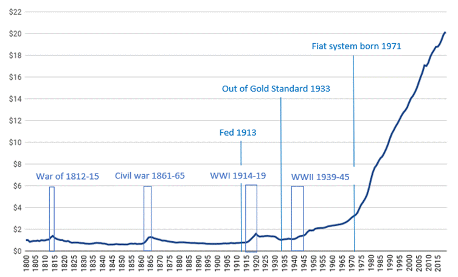
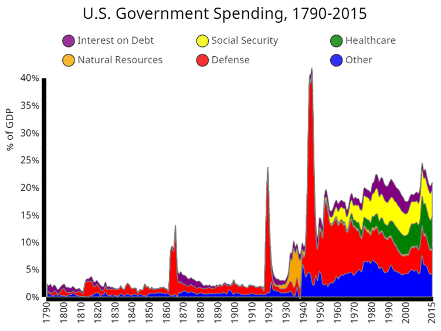
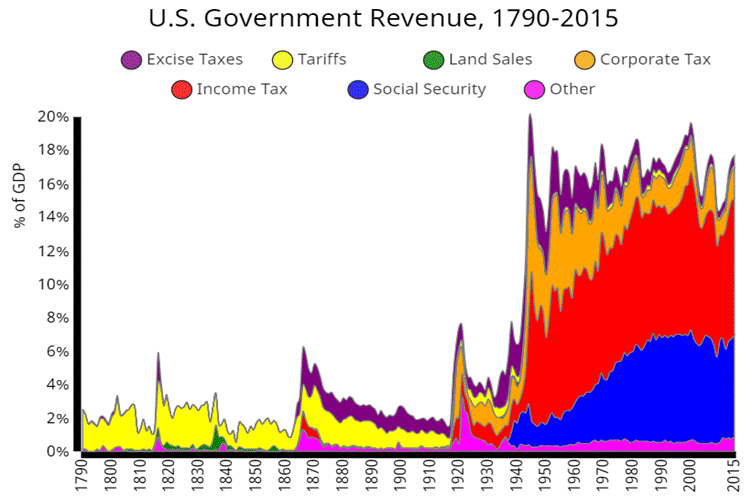
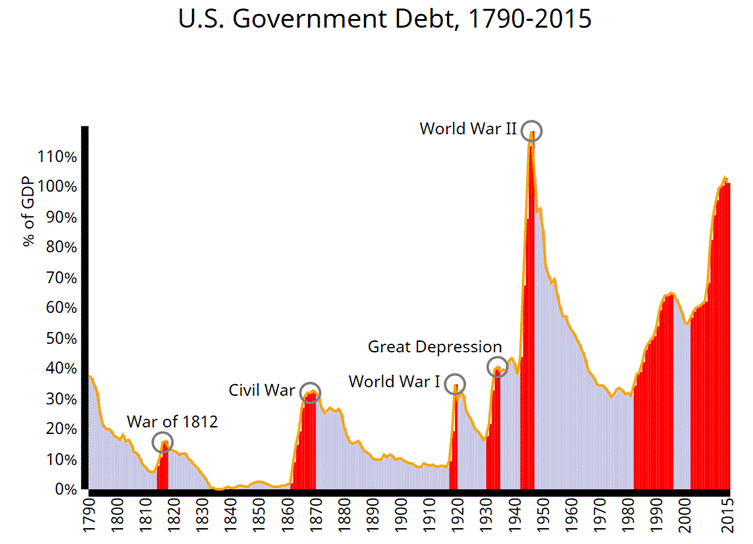
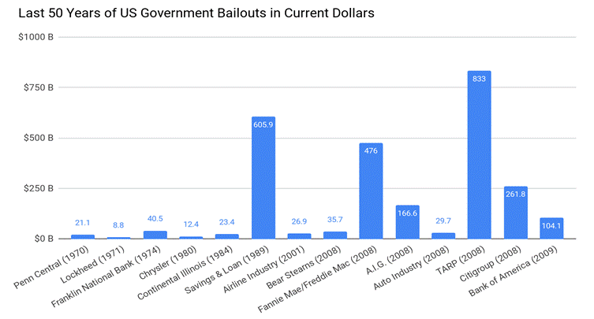
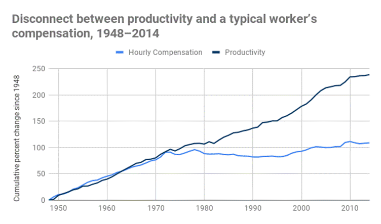
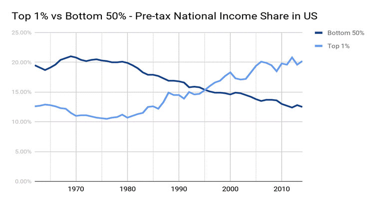
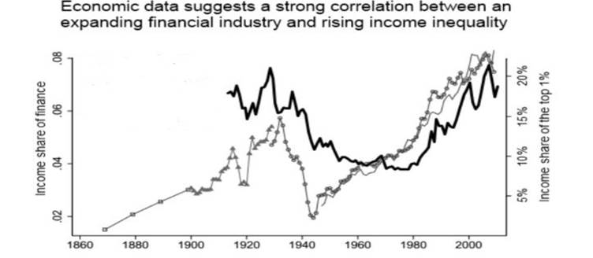

=== **Cryptocurrency and Democracy 2.0 - PART V**

===== *What are the consequences of these power centralized Fed, banks and fiat?*

*_I. Let's start with inflation itself._*

_Figure 2_

[big Navy]#____# [Navy]#*Marks CPI*#

[Blue]#____ Marks event years, not the prices#

[.underline]##https://www.businessinsider.in/CHART-Inflation-Since-1775-And-How-It-Took-Off-In-1933/articleshow/21482405.cms[Source:]## _Bureau of Labor Statistics, Historical Statistics of the United States, and Reinhart and Rogoff (2009)_

The above chart plots two centuries of inflation in the US. It uses Consumer Price Index (CPI) to measure the rate of inflation in a currency over a period.

In simple words, CPI answers the following question: If certain collection of household items could be bought with $1 in 1800, how much dollars it would cost to buy the same items over the next two centuries?

Until around 1910, those collection of household items was around $1. But their price started increasing after the Fed's establishment, and at 2019, the costs is $20.17. Cumulative price increase due to inflation is 1917%.

It is clear that from 1800 to 1913, other than war times in which the government inflated the money supply, there were no significant rise of goods and services. But after abandoning the gold standard in 1933 and after the introduction of fiat in 1971, the cost of goods and services started increasing tremendously**.**

People may point out that the salaries have also been increased, right? This will be answered in sixth consequence in our list.

'''''

*_II. Increase of government spending on wars and freebies_*

_Figure 3_

[.underline]##http://metrocosm.com/history-of-us-taxes/[Source:]## _metrocosm.com, The History of U.S. Government Spending, Revenue, and Debt (1790-2015)_

The chart depicts US government spending with respect to the percentage of GDP for 2 centuries.

All of these expenditures are funded by tax money from people. _Interest on Debt_ is also paid by people's money as we will see in the next chart. That's why the government's debt is directly related to people's own packet, and that's how the governments and banks extract it.

[width="100%",cols="100%",]
|===
a|
*Fact 3*

Around the 1910s, the per capita GDP (the measure of a country's standard of living) of the US surpassed that of the UK.

On 1870, US - $2,445 and UK - $3,190

On 1913, US - $5,301 and UK - $4,921

[.underline]##http://news.bbc.co.uk/2/hi/uk_news/7174996.stm[Source:]## _BBC_

|===

The above chart and facts clearly show that the people of the US overtook those in the British empire and became a world superpower without the government's big spending, central bank, fiat money, or wars. Before Fed, the US government did not have big money and control to intervene and slow down the economy with its various regulations and bureaucratic departments. All the great 19th century technological innovations and cultural value progress (abolishment of slavery) from the US didn't require Fed and Fiat.

'''''

*_III. Direct fund from people for wars & freebies_*

_Figure 4_

[.underline]##http://metrocosm.com/history-of-us-taxes/[Source:]## _metrocosm.com, The History of U.S. Government Spending, Revenue, and Debt (1790-2015)_

The chart provides an answer for the different sources of revenue for the US government for two centuries. Excise taxes and tariffs were mostly sufficient enough to run the US govt until 1913. The income tax and social security tax started consuming people's money and was spent on expensive wars and freebies.

But in reality, the money was not sufficient enough for wars and freebies. So the government's allies - central bank and commercial banks - came into the picture to print money for unlimited government debt.

'''''

*_IV. Indirect fund as debt from people for wars & freebies_*

_Figure 5_

[.underline]##http://metrocosm.com/history-of-us-taxes/[Source:]## _metrocosm.com, The History of U.S. Government Spending, Revenue, and Debt (1790-2015)_

This chart depicts the US debt for around two centuries, the red color marks the rise of debt.

In the 19th century, only during war times, the debt was increased and paid back with taxes and tariffs. Sometimes gold standard based inflation was also used to fund the war but it led to immediate recessions.

But after Fed was established by 1913, the great depression increased US debt tremendously. To patch up the mess created by depression, in the name of stimulating the economy, large amounts were spent on large public projects.

From 1970's, government debt again increased to WWII level along with below mentioned consequences. The credit for this again goes to the fiat system.

[width="100%",cols="100%",]
|===
a|
*Fact 4*

On February 11, 2019, the U.S. debt exceeded $22 trillion. That puts the U.S. debt-to-GDP ratio at 108 percent. The amount is around $22 trillion. It is $181,522 per taxpayer.

[.underline]##https://www.thebalance.com/trump-plans-to-reduce-national-debt-4114401[Source:]## _thebalance.com_

|===

The caveat here that the ever growing debt can only be reduced by additional bloated tax. Otherwise the government will buy more debt until the economy eventually collapses.

'''''

*_V. Bailouts and "Too big to fail"_*

What happens if the financial industry's bad practices leads to collapsing of a financial company/industry?

For example, there are many bad practices followed by the financial industry and planned bubbles is just one of them. Financial institutions deliberately create some financial bubbles to lure people into their trap (for example, 2008 US housing bubble). When the bubble pops, people lose money but before that the financial industry takes their cut and moves it to safer assets.

In the name of *_"Too big to fail"_* (a concept in which the government will intervene in situations where a business has become so deeply ingrained in the functionality of an economy that its failure would be disastrous to the economy at large), there comes government bailout with inflated or borrowed money to save them. This would mean more government debt.

But if there is no money printing and bailout options in the hands of an industry, "Too big to fail" would have never been an option at all.

_Figure 6_

[.underline]##https://www.propublica.org/article/government-bailouts[Source:]## _ProPublica Newsroom_

The above chart indicates that majority of the bailouts are financial institutions. Totally more than $2.6 trillion (in Jun 2019's USD value) was used to bailout in last 50 years.

This amount is equivalent to around 7% of current debt US government (22 trillion) or around $7983 per head of US population.

'''''

*_VI. Role of fiat money in redirection of the common man salary to government and banks_*

_Figure 7_

[.underline]##https://www.epi.org/publication/understanding-the-historic-divergence-between-productivity-and-a-typical-workers-pay-why-it-matters-and-why-its-real/[Source:]## _Economic Policy Institute_

From 1948 to 1973, employee productivity and compensation have grown 96.7% and 91.3% respectively. From 1973 to 2014, employee productivity has grown 72.2% but compensation has grown only to 9.2%.

Even though worker's compensation has increased in terms of dollars, it has not increased to properly compensate the reduction in purchasing power of the dollar. To convey it clearly, this chart depicts the disconnection between productivity and compensation in terms of percentages rather than actual dollars because that will hide the reality.

'''''

*_VII. Fiat money and income inequality_*

_Figure 8_

[.underline]##http://gabriel-zucman.eu/usdina/[Source:]## _Distributional National Accounts by Piketty, Saez & Zucman_

This chart depicts - from 1970s onwards, the beginning of earning inequality between top 1% and Bottom 50% in the US.

Corporates have easy access to inflated money from banks as corporate loans, hence they reap the firsthand benefits of receiving inflated money. These wealth are transferred to corporate executives as bonuses and shares. This is one of the ways the rich get richer at the cost of the poor.

'''''

*_VIII. Historical evidence of financial industry boosting income inequality_*

_Figure 9_

*[big]#__# Income share of top 1% wealthy people*

[Silver]#__ Income share of financial sector#

[.underline]##https://tcf.org/content/commentary/graph-how-the-financial-sector-consumed-americas-economic-growth/?session=1&session=1[Source:]## _The Century Foundation_

The chart depicts the link between financial sector and income inequality for two centuries as a percentage of the GDP of US.

Whenever the financial sector grows, the income share of the elite 1% of the world's rich grows. In other words, the wealth of 99% of people diminishes.

'''''

===== *_But how has the Fed managed this biased fiat beneficiary system for so long?_*

When an individual goes into a lot of debt beyond his capacity (or productivity) to payback, he can only default on his debt. This is similar to what happens to a government. However, a central bank can print its own money, right?

Even though, they have the possibility of printing money, overdoing it will reduce the value of money drastically and the effect will become visible to people.

It will naturally force anyone who holds the currency that is losing value to get rid of it and invest it in a safer asset such as gold and real estate, etc. This will further reduce the value of the money. It may also lead to an economic collapse like hyperinflation.

To avoid these kinds of worst case scenarios, the central banks use different kinds of tricks to control inflation and debt in the economy. One trick is to stop inflation for a while before the debt increase grows out of control, and another is to increase the interest rates to control people's spending, and to prevent businesses and government from buying further debts.
