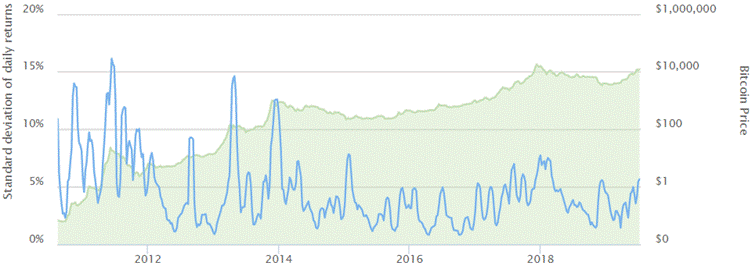
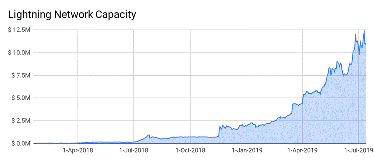

=== *Cryptocurrency and Democracy 2.0 - PART VI*

==== *What solution Cryptocurrency offers to the world?*

Cryptocurrency understands the flaws and loopholes of both the gold standard and a fiat based economy and their financial systems. And hence a solution to overcome these cannot be merely incremental in nature. The reform needs to be a radical transformation. As we come to understand all of this, the next big question is: How will Cryptocurrency be adopted by the people and government? But first let us understand what Cryptocurrency offers in detail.

Cryptocurrency's key features make central banks' inflation and monetary controls over people's money impossible. So financial institutions' profits will depend more on the productivity of economic activity rather than money manipulation and debt. Hence it encourages them to best utilize people's savings and investment towards profit and benefits to all the stakeholders in the economy.

It encourages a government to play a key role in supporting economic growth rather than playing cheap manipulative politics to survive.

Assuming world wide Cryptocurrency adoption has already occurred, let's see how the above specified changes will play out.

===== *_Let's first look at the primary means through which a government generates money and how Cryptocurrency changes the dynamics when it is adopted._*

[loweralpha]
. **Debt:** Getting loans may be hard for incompetent and corrupt governments. This is because with Cryptocurrency (absence of inflation), loan providers (other governments, international organizations, financial institutions and private investors) won't risk their hard earned money (Cryptocurrency). Debt in the model of printing money is not at all an option in the world of Cryptocurrency.

[loweralpha, start=2]
. **Taxes:** Usually rising taxes to individuals make the voters get disappointed in the government. When it is done to businesses, it forces businesses to lose profits that further leads to layoffs, and reduces the economic activity of the country in the long run. This again, leads to disappointment among voters.

[quote, Anonymous]
If cigarette taxes are meant to discourage smoking, wouldn't income taxes discourage working.

When Cryptocurrency is used as money - its privacy, borderless, permissionless and censorship resistance will be in action. Then there is an increased possibility of the individuals and the business community choosing to move their investment to other countries, or hide their assets.

Due to these foreseeable worst case scenarios and their impact on economy, they may force governments to maintain a feasible tax & tariff system proactively.

[quote, Calvin Coolidge, 30th President of the USA]
Collecting more taxes than is absolutely necessary is legalized robbery.

But what about anti money laundering controls which protect us from criminals and terrorists?

[width="100%",cols="100%",]
|===
a|
*_Fact 5_*

Anti money laundering enforcement fails 99.9% of the time.

In the US, money launderers face less than 5 percent risk of conviction (some plead to lesser charges). The situation in most areas of the world is even worse.

Global money laundering falls somewhere around two to five percent of global GDP - approximately $1.5 trillion to $3.7 trillion in 2015.

[.underline]##https://thefactcoalition.org/countering-international-money-laundering?utm_medium=policy-analysis/reports[Source:]## _Countering International Money Laundering - FACT Coalition_

|===

With Cryptocurrency, government's exploitation of people's money is less likely due to the above scenarios, and political bureaucrats may end up with just two options: They could either earn the hatred of the voters immediately resulting in going out of power soon, or are forced to make changes, transform, create businesses, make investment attractive, paving the way for a healthy economy to collect required taxes from individuals and businesses.

When compared with the past "monarchy to democracy" political revolution that took place, "power centralized govts to less power centralized govts" it is easier given the digital, non-violent, safe & personal monetary benefits involved in the transformation.

===== *_Ripple effects of cryptocurrency in government, economy and society_*

[arabic]
. **Law and order:** In case of Law and order problems in a country, the economy and business will not function effectively. This may negatively impact an important source of tax mandating the government maintain law & order.

[arabic, start=2]
. **Corruption & bribery: **Similarly, control on systemic corruption in the government may be mandated by politicians. This happens as they are important in fair selection and operational processes in various departments, contributing to ease of business and investment.

[arabic, start=3]
. **Bureaucracy: **Limited tax money may result in less bureaucracy and hence less bribery and friction, so the output of the economy will increase. It would happen since only much-needed government departments can get funded.

[arabic, start=4]
. **Cost of goods and services: **Cryptocurrency promises no/negligible rising cost of almost all of the goods and services, as government & financial institutions can't reduce the purchasing power of the money by printing it. _Refer figure 2 and below facts._

[width="100%",cols="100%",]
|===
a|
*_Fact 6_*

In the case of Venezuela which is facing hyperinflation, the price of a cup of coffee jumped from 3.80 bolivars (Venezuelan currency) to 5,500 in 12 months.

[.underline]##https://www.bloomberg.com/features/2016-venezuela-cafe-con-leche-index/[Source:]## _bloomberg.com_

|===

[width="100%",cols="100%",]
|===
a|
*_Fact 7_*

About 3 million Venezuelans - a tenth of the population have fled the country.

[.underline]##https://www.unhcr.org/news/press/2018/11/5be4192b4/number-refugees-migrants-venezuela-reaches-3-million.html[Source:]## _UN Refugee Agency_

|===

[width="100%",cols="100%",]
|===
a|
*_Fact 8_*

People started using Cryptocurrencies for savings and transactions since it is easy and safer for them than bolivars.

In the first week of Feb-2019, the amount of Bitcoin traded in Venezuela has soared by 30%, according to crypto data tracker Coin Dance. That's equivalent to approximately $8.95 million per week and $1.29 million per day during that time.

[.underline]##https://www.cnbc.com/2019/02/14/venezuela-crisis-bitcoin-trading-volumes-hit-an-all-time-high-.html[Source:]## _cnbc_

|===

[arabic, start=5]
. **Financial access: **There are many people who have no access to financial services such as banking, insurance, etc. So they lack opportunities such as loans for education, home, startups, business expansions, etc. However, just mobile phones and internet connections will be sufficient for Cryptocurrency to offer financial services to people.

[width="100%",cols="100%",]
|===
a|
*_Fact 9_*

Until 2018, globally, 1.7 billion adults remain unbanked, yet two-thirds of them own a mobile phone that could help them access financial services.

[.underline]##https://www.worldbank.org/en/news/press-release/2018/04/19/financial-inclusion-on-the-rise-but-gaps-remain-global-findex-database-shows[Source:]## _World Bank_

|===

[arabic, start=6]
. **Materialism: **Since there is no concern about erosion of purchasing power of money and there is an investment friendly business culture, people may prefer to invest in investments and savings, to grow their hard earned money. This may reduce the current consumerist and materialistic trend we are witnessing. It is called _low time preference._

[width="100%",cols="100%",]
|===
a|
*_Fact 10_*

The average savings rate of the seven largest economies was 12.66% in 1970 (starting of fiat), but has dropped to 3.39% in 2015.

[.underline]##https://www.amazon.in/Bitcoin-Standard-Decentralized-Alternative-Central/dp/1119473861[Source:]## _The Bitcoin Standard: The Decentralized Alternative to Central Banking by Saifedean Ammous_

|===

[arabic, start=7]
. **Natural resources: **With move away from consumerism, customers would prefer to save more rather than spend on low-need goods and services. This may reduce the exploitation of natural resources.

[arabic, start=8]
. **Innovation in goods and services: **Driven by business and investment friendly environment and people's low time preference, corporations and institutions may be encouraged to innovate not just on short-term gains but also on long-term solutions and technologies.

[width="100%",cols="100%",]
|===
a|
*_Fact 11_*

In _The History of Science and Technology by Bryan H. Bunch (Author), Alexander Hellemans (Editor)_ book that looks at 8583 most important innovations of the world.

It can be noted that the 19th century dominates the 20th century in the case of Zero to One Innovation count.

Zero to One are innovations that are completely new, not an advancement or scaling innovations over existing innovations.

Low time preference societies usually prefer to save money for long term which is then invested by financial institutions on Zero to One innovation projects, which are also generally long term.

|===

[arabic, start=9]
. **Corporate corruption: **In addition, in a business friendly ecosystem without corporate biased regulations, there may be an ease of entry for competitive startups who can raise investment & running business easily. This may challenge monopoly of corporations. Also supported by a low-corruption ecosystem, influence of powerful corporations over government may be reduced to an extent.

[arabic, start=10]
. **Crime: **More investment and business may lead to more jobs which necessitates more educated people in the society. Both of these results in reduction of crimes in our society.

[arabic, start=11]
. **War: **Due to limited revenue and debt sources, wars may not be considered as the right solution for conflicts. Even if initiated, they may not sustain for too long.

[width="100%",cols="100%",]
|===
a|
*_Fact 12_*

To raise funding for fighting WWI, Germany started abandoning the Gold Standard and moving to fiat since the government found it hard to collect taxes for war.

The legal ratio between the gold coin and paper currency was 33 percent but German government and it's central bank reduced it to 8 percent by printing money.

[.underline]##https://encyclopedia.1914-1918-online.net/article/war_finance_germany[Source:]## _1914-1918-online. International Encyclopedia of the First World War_

|===

[arabic, start=12]
. **International remittance: **When Cryptocurrency volatility is under control by wider adoption, there is no need for remittance service at all.

[width="100%",cols="100%",]
|===
a|
*_Fact 13_*

In 2018 overall global remittance was $689 billions, including $528 billions to developing countries. The usual transaction time is 3-5 days between most of the countries in the world. There are other limitations like the number of transactions, maximum amount to be transferred, etc.

The cost of sending $200 on 2018.

●	$26 for London to Lagos (Nigeria's largest city)

●	$40 for South Africa to Malawi (another African country)

●	$13.8 as global average

[.underline]##https://www.weforum.org/agenda/2015/03/why-we-need-to-cut-remittance-fees-now/[Source:]## _World Economic Forum_

|===

For now dozens of startups started international remittance service using Cryptocurrency.

[width="100%",cols="100%",]
|===
a|
*_Fact 14_*

Philippines is the world's fourth largest international remittance receiver amounting to $34 billion in 2018. Out of this, Cryptocurrency contributed to = $8.77 million.

_[.underline]##https://www.philstar.com/business/2019/04/21/1911143/virtual-currency-transactions-double-390-million-2018[Source]##: Bangko Sentral ng Pilipinas (BSP) - Central bank of Philippines_

|===

_Watch [.underline]#https://www.youtube.com/watch?v=LgI0liAee4s&t=137s[Escaping the Global Banking Cartel]# by Andreas M. Antonopoulos for more on Bitcoin vs Global Banking Industry._

===== *_The inevitable adoption of Cryptocurrency_*

Cryptocurrency adoption is growing fast as a speculative trading asset, long term investment asset and monetary commodity by different people around the world.

_Figure 10_

*Bitcoin Price and Volatility*

[Blue]#**___** Bitcoin volatility (changes in the price of Bitcoin over the time)#

[Lime]#**___** Bitcoin price in USD#

[.underline]##https://www.buybitcoinworldwide.com/volatility-index/[Source:]## _buybitcoinworldwide.com_

The chart depicts the price growth of Bitcoin and the reduction in volatility level from 16 Aug 2010 to 13 July 2019.

'''''

Worldwide mass Cryptocurrency adoption will be inevitable due to the following facts.

[arabic]
. *_Rapid advancement in Cryptocurrency technology and tools & services built for easy of use._*

Lightning Network, Schnorr Signatures, Mimblewimble, Dandelion, Taproot, Coinjoin - These are a few of the technological advancements proposed, or currently being developed to address Bitcoin's lack of privacy, low transaction speed, & high fee issues. These innovations may be integrated into Bitcoin in the next 2 years. More advanced upgrades are in the pipeline.

Let's take Lightning Network (LN) for example for the potential of the advancements in Cryptocurrency. Bitcoin has recently adopted LN technology to increase both transaction speed and privacy while simultaneously minimizing transaction cost to as low as 0.01 USD. Current transaction speed of LN is faster than VISA or MasterCard across the world.

_Figure 11_

Increase of LN capacity to handle higher transaction volumes from 19 Jan 2018 to 13 July 2019.

[.underline]##https://bitcoinvisuals.com/ln-capacity[Source:]## _bitcoinvisuals.com_

'''''

[arabic, start=2]
. *_People from countries which are going through monetary collapse opt in for Cryptocurrency_*

In case of Turkey, 18% of people own cryptocurrency as per [.underline]#https://twitter.com/Melt_Dem/status/1100813888986202119[ING]#. Refer _Fact 6 to 8_ for the adoption growth in Venezuela. Argentina and Colombia follows a similar story.

Given the monetary benefits of the Cryptocurrency, we may not be surprised even if some police and military personnel become silent stakeholders.

[arabic, start=3]
. *_Early adopting governments and corporates_*

Some governments embrace and support adoption of Cryptocurrency since they are looking for investments, businesses and job markets around it. Malta, Switzerland, Singapore, Estonia, Japan, Luxembourg are some of Cryptocurrency friendly governments in the world.

Square, Starbucks, Bakkt (a company established by the NYSE's parent company) are a few of the corporations that have already adopted or working on adopting Cryptocurrencies.

[arabic, start=4]
. *_Eventual fall of fiat money system_*

[width="100%",cols="100%",]
|===
a|
*_Fact 15_*

According to a study of 775 fiat currencies by DollarDaze.org, there is no historical precedence for a fiat currency that has succeeded in holding its value.

At the start of the first century, the Roman denarius (1st century A.D.) was a coin containing approximately 94 percent real silver. Forced by enormous debt, the empire started to devalue the currency. By the time the Roman empire collapsed, the denarius was made of 0.02 percent silver, and it became useless as a currency.

Hungary: Aug 1945 - July 1946&#160;&#160;&#160;&#160;&#160;&#160;&#160;&#160;&#160;&#160;&#160;&#160;&#160;&#160;&#160;&#160;&#160;&#160;&#160;&#160;Prices doubled every: 15 hours

Zimbabwe: Mar 2007 - Nov 2008&#160;&#160;&#160;&#160;&#160;&#160;&#160;&#160;&#160;&#160;&#160;&#160;&#160;&#160;&#160;&#160;Prices doubled every: 25 hours

Yugoslavia: Apr 1992 - Jan 1994&#160;&#160;&#160;&#160;&#160;&#160;&#160;&#160;&#160;&#160;&#160;&#160;&#160;&#160;&#160;&#160;&#160;&#160;Prices doubled every: 34 hours

Weimar Germany: Aug 1922 - Dec 1923&#160;&#160;&#160;&#160;Prices doubled every: 3 days, 17 hours

Greece: May 1941 - Dec 1945&#160;&#160;&#160;&#160;&#160;&#160;&#160;&#160;&#160;&#160;&#160;&#160;&#160;&#160;&#160;&#160;&#160;&#160;&#160;&#160;&#160;&#160;&#160;&#160;Prices doubled every: 4 days, 6 hours

China: Oct 1947 - May 1949&#160;&#160;&#160;&#160;&#160;&#160;&#160;&#160;&#160;&#160;&#160;&#160;&#160;&#160;&#160;&#160;&#160;&#160;&#160;&#160;&#160;&#160;&#160;&#160;&#160;&#160;&#160;Prices doubled every: 5 days, 8 hours

Peru: Jul 1990 - Aug 1990&#160;&#160;&#160;&#160;&#160;&#160;&#160;&#160;&#160;&#160;&#160;&#160;&#160;&#160;&#160;&#160;&#160;&#160;&#160;&#160;&#160;&#160;&#160;&#160;&#160;&#160;&#160;&#160;&#160;&#160;&#160;Prices doubled every: 13 days, 2 hours

France: May 1795 - Nov 1796&#160;&#160;&#160;&#160;&#160;&#160;&#160;&#160;&#160;&#160;&#160;&#160;&#160;&#160;&#160;&#160;&#160;&#160;&#160;&#160;&#160;&#160;&#160;&#160;Prices doubled every: 15 days, 2 hours

Since its issue in 1913, the US dollar has lost 92% of its value. The US has currently been increasing the supply of dollars by 13% every year to pay off its debt.

|===

[arabic, start=5]
. *_FOMO of rest of the individuals, businesses and governments after witnessing continuous rise of prices, adoption and economic system transformations_*

➢    Advancements in Cryptocurrency technology, tools and services

➢    People of money collapsing countries

➢    People & governments of early adopting countries

These will lead to rise of price of Cryptocurrency and its adoption which will make other individuals, businesses and governments to rush into it for their own benefit. It will create a snowball effect. What benefit governments will gain? They will see it as a reserve money and will not want to lose the opportunity of increasing their reserve of it.

_Refer [.underline]#https://medium.com/@vijayboyapati/the-bullish-case-for-bitcoin-6ecc8bdecc1[Bullish case of Bitcoin]# by Vijay Boyapati for more on inevitable adoption of Bitcoin._

==== *Conclusion*

Revolutions have looked different, and have resulted in different things in the past from people coming out to the streets, violence, boycotting, toppling governments to social agitation of people. Since the world is becoming increasingly digital, and almost every aspect of our life becoming digital, it is only obvious to predict that our revolutions can start to happen in the digital world too.

Cryptocurrency revolution will bring freedom, liberty and wealth for individuals by upgrading the current democracy to its next level - Democracy 2.0.

_Disclaimer: The views presented in this article and any errors herein are my own. This article is for information purposes only. It is not intended to be investment advice. Seek a duly licensed professional for investment advice._

_This article focuses on providing an introduction of Cryptocurrency to layman, hence it primarily covers the value proposition and promises of Cryptocurrency. So readers are requested to understand Cryptocurrency's flaws and risks before taking any action._

**_Thanks to:_** [.underline]#https://twitter.com/adam3us[Adam back]#, [.underline]##https://twitter.com/aantonop[Andreas M. Antonopoulos]##, [.underline]#https://twitter.com/bytemaster7[Dan Larimer]#, [.underline]##https://twitter.com/starkness[Elizabeth Stark]##, [.underline]##https://twitter.com/ErikVoorhees[Erik Voorhees]##, [.underline]#https://twitter.com/ivanontech[Ivan on Tech]#, [.underline]#https://twitter.com/lopp[Jameson Lopp]#, [.underline]#https://twitter.com/jimmysong[Jimmy Song]#, [.underline]#https://twitter.com/bitstein[Michael Goldstein]#, [.underline]#https://twitter.com/mike_maloney[Michael Maloney]#, [.underline]##https://en.wikipedia.org/wiki/Milton_Friedman[Milton Friedman]##, [.underline]##https://mises.org/[Mises Institute]##, [.underline]##https://twitter.com/muststopmurad[Murad Mahmudov]##, [.underline]#https://twitter.com/pierre_rochard[Pierre Rochard]#, [.underline]#https://twitter.com/APompliano[Pomp]#, [.underline]##https://twitter.com/prageru[PragerU]##, [.underline]##https://twitter.com/iam_preethi[Preethi Kasireddy]##, [.underline]##https://twitter.com/saifedean[Saifedean Ammous]##, [.underline]#https://twitter.com/excellion[Samson Mow]#, [.underline]##https://twitter.com/stephanlivera[Stephan Livera]##, [.underline]##https://twitter.com/tonysheng[Tony Sheng]##, [.underline]#https://twitter.com/real_vijay[Vijay Boyapati]#, [.underline]#https://www.youtube.com/channel/UCT3v6vL2H5HK4loLMc8pmCw[VisualPolitik]#, [.underline]##https://twitter.com/VitalikButerin[Vitalik Buterin]##
